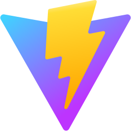

<h1 align="center">Welcome to my Github profile I'm Carlos Kaique :wave:</h1>

I've always been fascinated by technology, always looking for why and how things behind the screens work, I'm currently studying in a Technical School in the High School course with Professional Qualification of Systems Development Technician. My main focus is the Front-End.

 

<main display="flex">

  
:computer: I'm currently studying at [Etec Salles Gomes](https://www.cps.sp.gov.br/etecs/etec-salles-gomes/)  
:mailbox:	 You can contact me at [kaike1065@outlook.com](mailto:kaike1065@outlook.com) 
:eyes: interested in technologys that helps me solve problems  
:zap: Fun Fact: ***Never Give Up***  
  
<h3>Skills</h3>

 
 
<h3>Currently Studying</h3>

 
 
 
<h3>Familiarity</h3>

</main>

